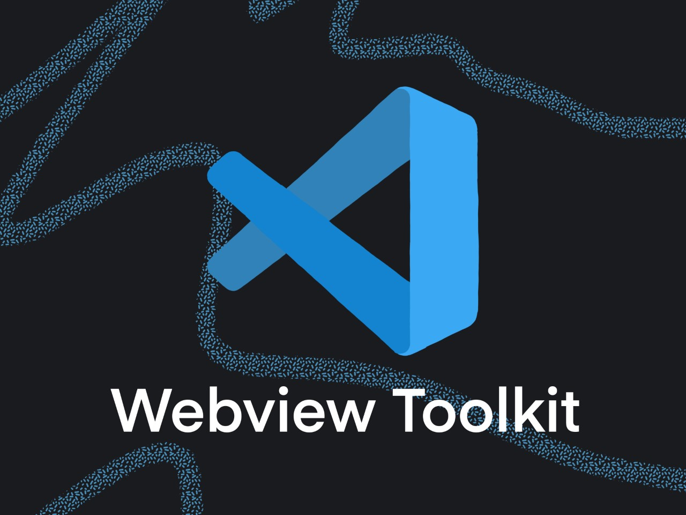

# Visual Studio Code Webview Toolkit

## Introduction

The VS Code Webview Toolkit is a component library made specifically for building webview-based extensions in VS Code.

This toolkit was created to give people the tools to build webview experiences that are consistent with the rest of VS Code. Features of the library include:

-   **Implements The VS Code Design Language:** All components implement the VS Code design language, enabling developers to create extensions that have a consistent look and feel with the rest of VS Code.
-   **Theming As A First Class Citizen:** All of the components were designed with theming in mind and the toolkit ships with utilities that automatically consume and apply VS Code color theme changes.
-   **Plays Nice With Your Tech Stack:** The library is built with web components meaning no matter what tech stack your using (React, Svelte, Vanilla JS, etc.) the component library will play nice.
-   **Accessible Out Of The Box:** All components ship with web standard compliant ARIA labels and keyboard navigation meaning you don't have to worry about accessibility.

## Getting Started

Follow the [Getting Started Guide](./docs/getting-started.md).

## Documentation

Beyond the Getting Started Guide, further documentation can be found in the following places:

-   [Component Docs](./docs/components.md)
-   [Storybook – Interactive Component Sandbox](https://microsoft.github.io/vscode-webview-toolkit/)
-   [Toolkit Extension Samples](https://github.com/microsoft/vscode-webview-toolkit-samples)
-   [VS Code Webview Guide](https://code.visualstudio.com/api/extension-guides/webview)
-   [VS Code Webview Guidelines](https://code.visualstudio.com/api/references/extension-guidelines#webviews)
-   [VS Code Extension API Docs](https://code.visualstudio.com/api)

## Contributing

This project welcomes contributions and suggestions. If you'd like to contribute, please submit a PR of your changes with a link to the issue or feature request that your code addresses. Additionally, please follow the [VS Code Coding Guidelines](https://github.com/microsoft/vscode/wiki/Coding-Guidelines).

Most contributions require you to agree to a Contributor License Agreement (CLA) declaring that you have the right to, and actually do, grant us the rights to use your contribution. For details, visit [cla.opensource.microsoft.com](https://cla.opensource.microsoft.com).

When you submit a pull request, a CLA bot will automatically determine whether you need to provide a CLA and decorate the PR appropriately (e.g., status check, comment). Simply follow the instructions provided by the bot. You will only need to do this once across all repos using our CLA.

This project has adopted the Microsoft Open Source Code of Conduct. For more information see the Code of Conduct FAQ or contact opencode@microsoft.com with any additional questions or comments.

## Legal Notices

Microsoft and any contributors grant you a license to the Microsoft documentation and other content
in this repository under the [Creative Commons Attribution 4.0 International Public License](https://creativecommons.org/licenses/by/4.0/legalcode), see the [LICENSE](LICENSE) file, and grant you a license to any code in the repository under the [MIT License](https://opensource.org/licenses/MIT), see the [LICENSE-CODE](LICENSE-CODE) file.

Microsoft, Windows, Microsoft Azure and/or other Microsoft products and services referenced in the documentation
may be either trademarks or registered trademarks of Microsoft in the United States and/or other countries.
The licenses for this project do not grant you rights to use any Microsoft names, logos, or trademarks.
Microsoft's general trademark guidelines can be found [here](http://go.microsoft.com/fwlink/?LinkID=254653).

Privacy information can be found [here](https://privacy.microsoft.com/en-us/).

Microsoft and any contributors reserve all other rights, whether under their respective copyrights, patents,
or trademarks, whether by implication, estoppel or otherwise.
