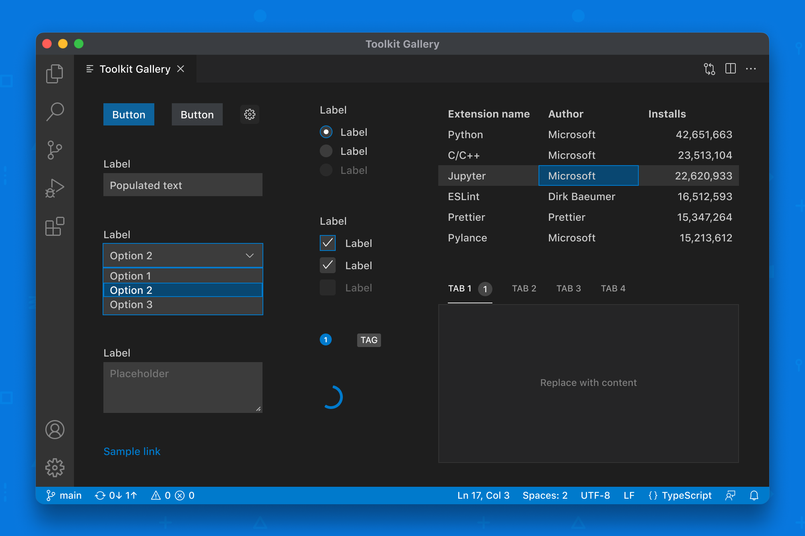

# Webview UI Toolkit for Visual Studio Code


[](https://www.npmjs.com/package/@vscode/webview-ui-toolkit)
[](./LICENSE)




## はじめに

Webview UI Toolkitは、Visual Studio Codeで[Webviewベースの拡張機能](https://code.visualstudio.com/api/extension-guides/webview)を構築するためのコンポーネントライブラリです。

このライブラリの特徴は以下の通りです:

-   **Visual Studio Codeデザインランゲージの実装:** すべてのコンポーネントは、Visual Studio Codeのデザインランゲージに準拠しています。開発者は、エディタの他の部分と一貫したルック＆フィールを持つ拡張機能を作成することができます。
-   **カラーテーマの自動サポート:** すべてのコンポーネントは、テーマを考慮して設計されており、現在のエディタテーマを自動的に表示します。
-   **任意の技術スタックを使用:** ライブラリはウェブコンポーネントのセットとして出荷されるため、開発者は拡張機能がどのような技術スタック (React、Vue、Svelteなど) で構築されていても、ツールキットを使用することができます。
-   **すぐに使える:** すべてのコンポーネントは、ウェブ標準に準拠したARIAラベルとキーボードナビゲーションを備えています。

必要な場合を除いて、拡張機能でのWebビューの使用を避けるという推奨事項は変更されないことに注意してください。詳しい内容は [こちら](https://code.visualstudio.com/api/references/extension-guidelines#webviews) で確認ください。

## リリース

Webview UI Toolkitは、現在パブリックプレビューです。1.0に向けての進捗状況は[こちら](https://github.com/microsoft/vscode-webview-ui-toolkit/issues?q=is%3Aopen+is%3Aissue+milestone%3Av1.0)をご覧ください。

### 既知の問題

中～高レベルの問題で、高い優先度で修正されることを意図しています。

-   Options within `vscode-dropdown` do not announce their text content on selection change [#181](https://github.com/microsoft/vscode-webview-ui-toolkit/issues/181)
-   Icon alignment issues when nested within components [#193](https://github.com/microsoft/vscode-webview-ui-toolkit/issues/193)

## 入門ガイド

[Getting Started Guide](./docs/getting-started.md) にそって操作を行ってください。

すでにWebベースの拡張機能をお持ちの場合は、以下のコマンドでツールキットをインストールできます:

```
npm install --save @vscode/webview-ui-toolkit
```

## ドキュメント

詳しいドキュメントは以下で公開されています:

-   [Component Docs](./docs/components.md)
-   [Storybook (Interactive Component Sandbox)](https://microsoft.github.io/vscode-webview-ui-toolkit/)
-   [Toolkit Extension Samples](https://github.com/microsoft/vscode-webview-ui-toolkit-samples)
-   [Visual Studio Code Webview Guide](https://code.visualstudio.com/api/extension-guides/webview)
-   [Visual Studio Code Webview Guidelines](https://code.visualstudio.com/api/references/extension-guidelines#webviews)
-   [Visual Studio Code Extension API Docs](https://code.visualstudio.com/api)

## 貢献する

[contributing](./CONTRIBUTING.md) ドキュメント(英語)をご覧ください。

## 法律上の注意

Microsoft and any contributors grant you a license to any code in the repository under the [MIT License](https://opensource.org/licenses/MIT), see the [LICENSE](LICENSE) file.

This project may contain trademarks or logos for projects, products, or services. Authorized use of Microsoft trademarks or logos is subject to and must follow [Microsoft’s Trademark & Brand Guidelines](https://www.microsoft.com/en-us/legal/intellectualproperty/trademarks). Use of Microsoft trademarks or logos in modified versions of this project must not cause confusion or imply Microsoft sponsorship. Any use of third-party trademarks or logos are subject to those third-party’s policies.

Privacy information can be found [here](https://privacy.microsoft.com/en-us/).

Microsoft and any contributors reserve all other rights, whether under their respective copyrights, patents, or trademarks, whether by implication, estoppel or otherwise.
