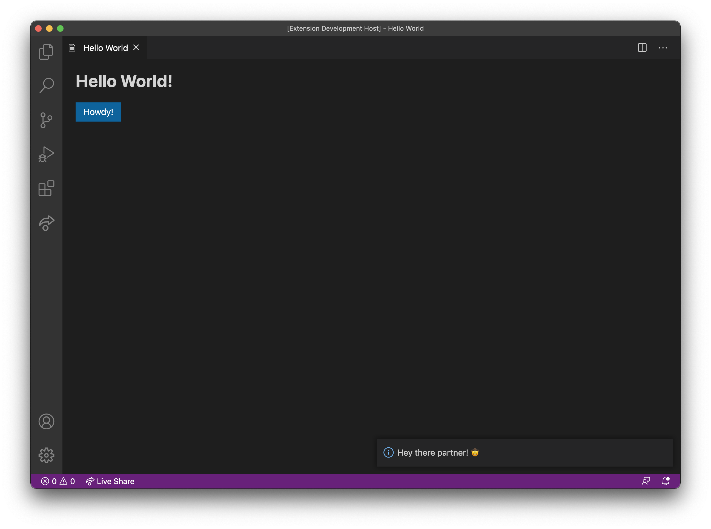

# Getting Started Guide

This guide will cover the following steps to get you up and running with the Webview UI Toolkit.

1. Create a webview-based extension
2. Install and set up the toolkit
3. Set up message passing between the extension and webview

_If you get stuck at any point, a completed sample extension based on this guide (and with extensive documentation comments) can be found [here](https://github.com/microsoft/vscode-webview-ui-toolkit-samples/tree/main/hello-world)._

## Part 1: Create a webview-based extension

Before installing the toolkit we need to create a webview-based extension to use the toolkit in. The following steps are taken directly from the Visual Studio Code [Your First Extension Guide](https://code.visualstudio.com/api/get-started/your-first-extension) and [Webview API Guide](https://code.visualstudio.com/api/extension-guides/webview).

To generate a basic extension we can use [Yeoman](https://yeoman.io/) and the [Visual Studio Code Extension Generator](https://www.npmjs.com/package/generator-code). Make sure you have [Node.js](https://nodejs.org/en/) and [Git](https://git-scm.com/) installed first, then install Yeoman and the generator using the following command:

```bash
npm install -g yo generator-code
```

The generator will scaffold a TypeScript or JavaScript extension ready for development.

Run the generator and fill out a few fields for a TypeScript extension:

```bash
yo code

# ? What type of extension do you want to create? New Extension (TypeScript)
# ? What's the name of your extension? helloworld
# ? What's the identifier of your extension? helloworld
# ? What's the description of your extension? LEAVE BLANK
# ? Initialize a git repository? Yes
# ? Bundle the source code with webpack? No
# ? Which package manager to use? npm

code ./helloworld
```

### Create a webview

With this basic extension created, we now need to create a webview. The following steps are an adapted version of those provided in the [Webview API Guide](https://code.visualstudio.com/api/extension-guides/webview)––for more information about webviews visit the guide.

Start by navigating to the `extensions.ts` file inside the `src` directory and replacing the contents of the `activate` function with the following:

```typescript
// file: src/extension.ts

export function activate(context: vscode.ExtensionContext) {
  const helloCommand = vscode.commands.registerCommand("helloworld.helloWorld", () => {
    HelloWorldPanel.render();
  });

  context.subscriptions.push(helloCommand);
}
```

At this point you'll probably have noticed that there is an error because `HelloWorldPanel` does not exist, so let's fix that!

### Create a webview panel class

Create a new directory/file at `src/panels/HelloWorldPanel.ts`.

Inside this file we're going to create a class that manages the state and behavior of Hello World webview panels.

It will contain all the data and methods for:

- Creating and rendering Hello World webview panels
- Properly cleaning up and disposing of webview resources when the panel is closed
- Setting the HTML content of the webview panel
- Setting message listeners so data can be passed between the webview and extension

**Constructor and properties**

Start by importing the Visual Studio Code API and creating an exported `HelloWorldPanel` class with the following properties and constructor method:

```typescript
// file: src/panels/HelloWorldPanel.ts

import * as vscode from "vscode";

export class HelloWorldPanel {
  public static currentPanel: HelloWorldPanel | undefined;
  private readonly _panel: vscode.WebviewPanel;
  private _disposables: vscode.Disposable[] = [];

  private constructor(panel: vscode.WebviewPanel) {
    this._panel = panel;
  }
}
```

**Render method**

We can now add the render method which will be responsible for rendering the current webview panel if it exists or creating and a displaying a new webview panel if it does not.

```typescript
// file: src/panels/HelloWorldPanel.ts

export class HelloWorldPanel {
  // ... properties and constructor method ...

  public static render() {
    if (HelloWorldPanel.currentPanel) {
      HelloWorldPanel.currentPanel._panel.reveal(vscode.ViewColumn.One);
    } else {
      const panel = vscode.window.createWebviewPanel("helloworld", "Hello World", vscode.ViewColumn.One, {
        // Empty for now
      });

      HelloWorldPanel.currentPanel = new HelloWorldPanel(panel);
    }
  }
}
```

At this point we can also go back to the `src/extension.ts` file and add an import statement to resolve the error from earlier.

```typescript
// file: src/extension.ts

import * as vscode from "vscode";
import { HelloWorldPanel } from "./panels/HelloWorldPanel";

// ... activate function ...
```

**Dispose method**

Back in the `HelloWorldPanel` class we now need to define a `dispose` method so that webview resources are cleaned up when a the webview panel is closed by the user or closed programmatically.

```typescript
// file: src/panels/HelloWorldPanel.ts

export class HelloWorldPanel {
  // ... other properties and methods ...

  public dispose() {
    HelloWorldPanel.currentPanel = undefined;

    this._panel.dispose();

    while (this._disposables.length) {
      const disposable = this._disposables.pop();
      if (disposable) {
        disposable.dispose();
      }
    }
  }
}
```

With the `dispose` method defined we also need to update the constructor method by adding an `onDidDispose` event listener so the method can be triggered when the webview panel is closed.

```typescript
// file: src/panels/HelloWorldPanel.ts

private constructor(panel: vscode.WebviewPanel) {
    // ... other code ...

    this._panel.onDidDispose(this.dispose, null, this._disposables);
}
```

**Get webview content method**

The `_getWebviewContent` method is where the UI of the extension will be defined.

This is also the place where references to CSS and JavaScript files/packages are created and inserted into the webview HTML. We will configure the Webview UI Toolkit here, in the second part of this guide.

```typescript
// file: src/panels/HelloWorldPanel.ts

export class HelloWorldPanel {
  // ... other properties and methods ...

  private _getWebviewContent() {
    // Tip: Install the es6-string-html VS Code extension to enable code highlighting below
    return /*html*/ `
      <!DOCTYPE html>
      <html lang="en">
        <head>
          <meta charset="UTF-8">
          <meta name="viewport" content="width=device-width, initial-scale=1.0">
          <title>Hello World!</title>
        </head>
        <body>
          <h1>Hello World!</h1>
        </body>
      </html>
    `;
  }
}
```

This is another point where we need to update our constructor method to set the HTML content for the webview panel.

```typescript
// file: src/panels/HelloWorldPanel.ts

private constructor(panel: vscode.WebviewPanel) {
    // ... other code ...

    this._panel.webview.html = this._getWebviewContent();
}
```

**Set message listener method**

We'll handle this in the the third part of this guide.

### Test that it all works

Congratulations! You have officially created a basic webview extension.

To test that everything is working, inside the editor, press `F5`. This will compile and run the extension in a new Extension Development Host window.

When the host window opens, open the Command Palette (`Crtl + Shift + P` or `Cmd + Shift + P` on Mac), type "Hello World", and click `enter` to run the command which should display the webview panel.


## Part 2: Install and set up the toolkit

With an extension created, we can now install the toolkit package using this command.

```
npm install --save @microsoft/vscode-webview-ui-toolkit
```

### Using the toolkit inside a webview

With the package installed, we need to adjust the project so the toolkit is usable within our webview. We'll start by updating the `_getWebviewContent` method we defined earlier to accept two new parameters.

```typescript
// file: src/panels/HelloWorldPanel.ts

private _getWebviewContent(webview: vscode.Webview, extensionUri: vscode.Uri) {
  // ... Implementation details should be left unchanged for now ...
}
```

With this change we all need to update the parameters of a few other methods and method calls.

Update the `constructor` method with the following:

```typescript
// file: src/panels/HelloWorldPanel.ts

private constructor(panel: vscode.WebviewPanel, extensionUri: vscode.Uri) {
  // ... other code ...

  this._panel.webview.html = this._getWebviewContent(this._panel.webview, extensionUri);
}
```

Update the `render` method with the following:

```typescript
// file: src/panels/HelloWorldPanel.ts

public static render(extensionUri: vscode.Uri) {
  // ... other code ...

  HelloWorldPanel.currentPanel = new HelloWorldPanel(panel, extensionUri);
}
```

Finally in `src/extension.ts` update the call to the `render` method:

```typescript
// file: src/extension.ts

HelloWorldPanel.render(context.extensionUri);
```

### Create a webview uri

With those changes we can now use some Visual Studio Code APIs to create a URI pointing to the toolkit package. These API calls can get a bit verbose however so we'll also create a small helper function to keep our code clean.

Create a new file at `src/utilities/getUri.ts` with the following:

```typescript
// file: src/utilities/getUri.ts

import { Uri, Webview } from "vscode";

export function getUri(webview: Webview, extensionUri: Uri, pathList: string[]) {
  return webview.asWebviewUri(Uri.joinPath(extensionUri, ...pathList));
}
```

We can use that helper function to get a webview URI pointing to the toolkit package.

```typescript
// file: src/panels/HelloWorldPanel.ts

import { getUri } from "../utilities/getUri";

// ... other code ...

private _getWebviewContent(webview: vscode.Webview, extensionUri: vscode.Uri) {
  const toolkitUri = getUri(webview, extensionUri, [
    "node_modules",
    "@microsoft",
    "vscode-webview-ui-toolkit",
    "dist",
    "toolkit.js",
  ]);

  // ... other code ...
}
```

### Pass the uri into the webview

With access to the toolkit URI we can pass it into our webview context with a regular `<script>` tag like so:

```typescript
// file: src/panels/HelloWorldPanel.ts

private _getWebviewContent(webview: vscode.Webview, extensionUri: vscode.Uri) {
  // ... toolkit uri ...

  return /*html*/ `
    <!DOCTYPE html>
    <html lang="en">
      <head>
        <meta charset="UTF-8">
        <meta name="viewport" content="width=device-width,initial-scale=1.0">
        <script type="module" src="${toolkitUri}"></script>
        <title>Hello World!</title>
      </head>
      <body>
        <h1>Hello World!</h1>
      </body>
    </html>
  `;
}
```

### Update webview configurations

Before we can test these updates, the final thing we need to do is update the webview panel configuration option we left empty earlier in the `render` method so that JavaScript is enabled in the webview.

```typescript
// file: src/panels/HelloWorldPanel.ts

public static render(extensionUri: vscode.Uri) {
  // ... other code ...

  const panel = vscode.window.createWebviewPanel(
    "helloworld",
    "Hello World",
    vscode.ViewColumn.One,
    {
      enableScripts: true,
    }
  );

  // ... other code ...
}
```

### Test that it all works

Let's check that everything works by adding a `<vscode-button>` to the webview and then opening the extension in the Extension Development Host window by pressing `F5`.

```typescript
// file: src/panels/HelloWorldPanel.ts

private _getWebviewContent(webview: vscode.Webview, extensionUri: vscode.Uri) {
  // ... other code ...

  return /*html*/ `
    <!DOCTYPE html>
    <html lang="en">
      <head>
        <meta charset="UTF-8">
        <meta name="viewport" content="width=device-width,initial-scale=1.0">
        <script type="module" src="${toolkitUri}"></script>
        <title>Hello World!</title>
      </head>
      <body>
        <h1>Hello World!</h1>
        <vscode-button id="howdy">Howdy!</vscode-button>
      </body>
    </html>
  `;
}
```


Theming is built right into the components so feel free to test that out too!

Open the Command Pallette (`Crtl + Shift + P` or `Cmd + Shift + P` on Mac), search for "Preferences: Color Theme", and cycle through all the themes to see the components change!


## Part 3: Set up message passing

In the final part of this guide we will adjust the extension once more so that when the `<vscode-button>` is clicked a Visual Studio Code information message is displayed with some text.

### Create message listener method

We can now finally create the `_setWebviewMessageListener` method in our `HelloWorldPanel` class. It will be responsible for setting up an event listener that listens for messages passed from the webview context and executes code based on the message that is recieved.

```typescript
// file: src/panels/HelloWorldPanel.ts

export class HelloWorldPanel {
  // ... other properties and methods ...

  private _setWebviewMessageListener(webview: vscode.Webview) {
    webview.onDidReceiveMessage(
      (message: any) => {
        const command = message.command;
        const text = message.text;

        switch (command) {
          case "hello":
            vscode.window.showInformationMessage(text);
            return;
        }
      },
      undefined,
      this._disposables
    );
  }
}
```

We also need to call this method in our constructor.

```typescript
// file: src/panels/HelloWorldPanel.ts

private constructor(panel: vscode.WebviewPanel, extensionUri: vscode.Uri) {
  // ... other code ...

  this._setWebviewMessageListener(this._panel.webview);
}
```

### Create message sending code

With the message listener code created, we need some message sending code.

This will come in the form of a `main.js` file that will send a message whenever the `vscode-button` is clicked.

Create a new file at `media/main.js`.

```javascript
// file: media/main.js

const vscode = acquireVsCodeApi();

window.addEventListener("load", main);

function main() {
  const howdyButton = document.getElementById("howdy");
  howdyButton.addEventListener("click", handleHowdyClick);
}

function handleHowdyClick() {
  vscode.postMessage({
    command: "hello",
    text: "Hey there partner! 🤠",
  });
}
```

In order for this `main.js` file to run in the first place, the last thing to do is to create and pass a URI into the webview HTML just like we did for the toolkit package.

```typescript
// file: src/panels/HelloWorldPanel.ts

private _getWebviewContent(webview: vscode.Webview, extensionUri: vscode.Uri) {
  // ... other code ...

  const mainUri = getUri(webview, extensionUri, ["media","main.js"]);

  return /*html*/ `
    <!DOCTYPE html>
    <html lang="en">
      <head>
        <meta charset="UTF-8">
        <meta name="viewport" content="width=device-width,initial-scale=1.0">
        <script type="module" src="${toolkitUri}"></script>
        <script type="module" src="${mainUri}"></script>
        <title>Hello World!</title>
      </head>
      <body>
        <h1>Hello World!</h1>
        <vscode-button id="howdy">Howdy!</vscode-button>
      </body>
    </html>
  `;
}
```

### One final test

Per usual, let's test that this all works by running the extension and clicking the on the Howdy button.



## Next steps

Congratulations on getting started with the Webview UI Toolkit! 🎊

You can find a [completed hello world extension](https://github.com/microsoft/vscode-webview-ui-toolkit-samples/tree/main/hello-world) based on this guide that includes documentation comments explaining the code in even more detail.

Further component documentation and guides on how to work with webviews is also provided too. Happy hacking!

- [Component Docs](./components.md)
- [Storybook – Interactive Component Sandbox](https://microsoft.github.io/vscode-webview-ui-toolkit/)
- [Toolkit Extension Samples](https://github.com/microsoft/vscode-webview-ui-toolkit-samples)
- [Visual Studio Code Webview Guide](https://code.visualstudio.com/api/extension-guides/webview)
- [Visual Studio Code Webview Guidelines](https://code.visualstudio.com/api/references/extension-guidelines#webviews)
- [Visual Studio Code Extension API Docs](https://code.visualstudio.com/api)
