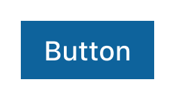
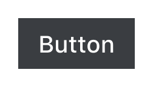
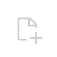

# Visual Studio Code Button

The `vscode-button` is a web component implementation of a [button element](https://developer.mozilla.org/en-US/docs/Web/HTML/Element/button). The `vscode-button` also supports several visual appearances––primary, secondary, and icon.


## Usage

### Types

| Type      | Example                                                                                               | Usage                                                                              |
| --------- | ----------------------------------------------------------------------------------------------------- | ---------------------------------------------------------------------------------- |
| Primary   |      | Emphasizes the highest priority action in a view.                                  |
| Secondary |  | Used for additional actions in a view that already features a primary action.      |
| Icon      |             | A space-efficient style that renders a single icon to represent a specific action. |

### Best Practices

| ❌ Don't                                                           | ✅ Do                                                                              |
| ------------------------------------------------------------------ | ---------------------------------------------------------------------------------- |
|  |  |
| Don't use multiple primary buttons in close proximity.             | Provide a single primary button with one or more secondary actions                 |

| ❌ Don't                                                                | ✅ Do                                                               |
| ----------------------------------------------------------------------- | ------------------------------------------------------------------- |
|  |  |
| Don't use fully capitalized or lowercase text.                          | Use sentence case for all button text.                              |

| ❌ Don't                                                            | ✅ Do                                                                                          |
| ------------------------------------------------------------------- | ---------------------------------------------------------------------------------------------- |
|  |                               |
| Don't use vague action text.                                        | Use clear verbs like "Save" or "Cancel" to ensure users feel confident when peforming actions. |

| ❌ Don't                                                                                    | ✅ Do                                                                                  |
| ------------------------------------------------------------------------------------------- | -------------------------------------------------------------------------------------- |
|                             |  |
| Don't use buttons as navigational elements. Use a [vscode-link](../link/README.md) instead. | Use buttons to perform actions relevant to the current view.                           |

| ❌ Don't                                                                       | ✅ Do                                                                                                       |
| ------------------------------------------------------------------------------ | ----------------------------------------------------------------------------------------------------------- |
|  |                                             |
| Don't use an icon button for primary actions.                                  | Use icon buttons for supporting actions in space-constrained layouts. Use icons that convey clear outcomes. |

## Implementation

[Interactive component examples](https://codesandbox.io/s/button-sample-c0v1fi?file=/index.html)

### Attributes

| Attribute        | Type    | Description                                                                             |
| ---------------- | ------- | --------------------------------------------------------------------------------------- |
| `appearance`     | string  | Determines the visual appearance _(primary, secondary, icon)_ of the button.            |
| `aria-label`     | string  | Defines a label for buttons that screen readers can use.                                |
| `autofocus`      | boolean | Determines if the element should receive document focus on page load.                   |
| `disabled`       | boolean | Prevents the user from interacting with the button––it cannot be pressed or focused.    |
| `form`           | string  | See [MDN](https://developer.mozilla.org/en-US/docs/Web/HTML/Element/button#attributes). |
| `formaction`     | string  | See [MDN](https://developer.mozilla.org/en-US/docs/Web/HTML/Element/button#attributes). |
| `formenctype`    | string  | See [MDN](https://developer.mozilla.org/en-US/docs/Web/HTML/Element/button#attributes). |
| `formmethod`     | string  | See [MDN](https://developer.mozilla.org/en-US/docs/Web/HTML/Element/button#attributes). |
| `formnovalidate` | string  | See [MDN](https://developer.mozilla.org/en-US/docs/Web/HTML/Element/button#attributes). |
| `formtarget`     | string  | See [MDN](https://developer.mozilla.org/en-US/docs/Web/HTML/Element/button#attributes). |
| `name`           | string  | See [MDN](https://developer.mozilla.org/en-US/docs/Web/HTML/Element/button#attributes). |
| `type`           | string  | See [MDN](https://developer.mozilla.org/en-US/docs/Web/HTML/Element/button#attributes). |
| `value`          | string  | See [MDN](https://developer.mozilla.org/en-US/docs/Web/HTML/Element/button#attributes). |

### Basic Button

```html
<vscode-button>Button Text</vscode-button>
```

### Appearance Attribute

There are a number of visual appearances that the `vscode-button` can have. The default appearance is `primary`.

```html
<vscode-button appearance="primary">Button Text</vscode-button>
<vscode-button appearance="secondary">Button Text</vscode-button>
<vscode-button appearance="icon">
  <span class="codicon codicon-check"></span>
</vscode-button>
```

### Autofocus Attribute

```html
<vscode-button autofocus>Button Text</vscode-button>
```

### Disabled Attribute

```html
<vscode-button disabled>Button Text</vscode-button>
```

### Start Icon

An icon can be added to the left of Button text by adding an element with the attribute `slot="start"`.

```html
<!-- Note: Using Visual Studio Code Codicon Library -->

<vscode-button>
  Button Text
  <span slot="start" class="codicon codicon-add"></span>
</vscode-button>
```

### Icon Only

An icon can also fill the default slot of the Button component (instead of text) to create an icon button by using the `appearance="icon"` attribute and value.

**❗️❗️❗️ Important ❗️❗️❗️**

Because icon buttons do not have text that can be used by screen readers, they are not meaningfully/semantically accessible by default.

An `aria-label` of "Icon Button" is automatically defined on all icon buttons so they are still technically accessible out of the box, however, a descriptive and meaningful label that fits the use case or context of the icon button should be defined to replace the default label.

For example, if you're using an icon button to confirm a state change, adding an `aria-label` with the value "Confirm" or "Confirm Changes" would be appropriate.

```html
<!-- Note: Using Visual Studio Code Codicon Library -->

<vscode-button appearance="icon" aria-label="Confirm">
  <span class="codicon codicon-check"></span>
</vscode-button>
```
